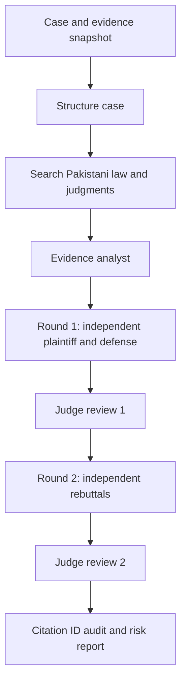

# LexForum

A Pakistan-focused legal-analysis workspace built for a bootcamp final project. Submit a scenario, attach evidence, research legislation and judgments, and watch plaintiff and defense agents challenge each other across two rounds. A judge evaluator reviews each round, then a reporting agent produces a cited risk assessment.

**Stack:** FastAPI · LangGraph · Pydantic · React + TypeScript · Tailwind CSS · SQLite · Google Gemini with Google Search grounding.

## Run locally

Requires Python 3.12+, Node.js 22+ and [uv](https://docs.astral.sh/uv/).

```bash
uv sync --python 3.12 --locked
npm --prefix frontend ci
cp .env.example .env  # Only if .env does not already exist; do not overwrite your configured key.
# Set GEMINI_API_KEY in .env for live analysis.
./scripts/start.sh
```

Open **http://127.0.0.1:8000**. Interactive API documentation is at **http://127.0.0.1:8000/docs**. The startup script builds the frontend and serves the entire app through FastAPI, keeping API requests on the same origin. Stop with Ctrl+C. The API key stays on the server.

The supplied project has a local `.env` configuration, which is intentionally ignored. **Never commit or distribute that file or the local database.** Use `.env.example` when handing in the project.

### Development

```bash
# Terminal 1, project root
PYTHONPATH=backend .venv/bin/uvicorn app.main:app --reload --host 127.0.0.1 --port 8000
# Terminal 2
npm --prefix frontend run dev
```

The Vite development server proxies `/api` to FastAPI. Open the URL Vite prints.

### Container option

```bash
docker compose up --build
```

The Docker configuration is supplied for portability; it binds the host port to localhost and saves records in a Docker volume. It must be validated on a machine with Docker installed. This is a single-user application, not a publicly hosted multi-tenant service.

## Features

1. **Case intake:** Pakistan province/territory, case category, parties, requested relief and scenario. AI extracts a summary, numbered claims, legal issues, chronology and missing facts.
2. **Legal research:** Case-specific research and a standalone search assistant, using Gemini's Google Search grounding. The returned source register contains actual provider-supplied URLs, supporting passages and retrieval timestamps. Statutory provisions and precedents are reported only when they carry known source IDs.
3. **Evidence:** Upload text-based PDF, DOCX, TXT, Markdown or CSV; alternatively paste statements or correspondence. Extracted text, submission side, metadata and SHA-256 fingerprint are preserved. The evidence agent maps relevance, support, challenges, contradictions and limitations.
4. **Two adversarial rounds:** Plaintiff and defense draft independently from the same state. The judge reviews both. Both advocates then see the prior round and judicial questions, submit rebuttals, and receive a second judicial evaluation.
5. **Risk report:** Executive assessment, qualitative argument strengths and confidence, applicable law, precedents, gaps, risks, mitigations, next steps and source register. Download Markdown or the full JSON record; print the report to PDF through the browser.
6. **Auditability:** Immutable case snapshot per run, stage events, timestamps, model identity, analysis history and persistent partial results on failure.

## Live mode and offline demonstration

Live analysis requires a working Gemini API key and sufficient provider quota. The configured model is `gemini-3.6-flash`; override `GEMINI_MODEL` if your provider account supports another model with structured output and Google Search grounding. One full run makes **10 generation calls before retries**. Provider pricing and quotas apply; this application does not enable billing or purchase a plan.

The included **fictional Lahore service-contract case** can also run without a key. Offline mode executes the same LangGraph stages using deterministic fixtures. It is labeled throughout the interface and exports. **It does not research law and cannot analyze arbitrary user cases.** Adding evidence to the sample disables fixture mode for that case.

## Workflow



The graph has eight persisted stages. Each argument stage uses `asyncio.gather` for independent opposing submissions. The second round gets both first-round submissions and the first judge review; neither advocate sees the other's current-round draft. See [the architecture notes](docs/ARCHITECTURE.md) and [presentation guide](docs/DEMO.md).

## Validation

```bash
.venv/bin/pytest -q
npm --prefix frontend run build
```

Tests cover input validation, upload formats and duplicates, cross-origin and optional token guards, two complete adversarial rounds, independent agent contexts, persistent partial failure, invalid citation removal, missing evidence coverage, report exports and interrupted-run recovery. No real confidential case material is used in tests.

## Data and scope

- Case and run JSON records are stored in `backend/app/data/lexforum.sqlite3`, configurable through `DATA_DIR`.
- The database stores **extracted text**, not original uploaded files. Keep original exhibits separately. The fingerprint identifies the originally submitted bytes; it does not authenticate them.
- Limit: 10 MB/file, 150 PDF pages, 60,000 extracted characters/file, 20 evidence items and 180,000 total evidence characters/case.
- Scanned pages and embedded images are not OCR-processed. Empty scans are rejected; partly unreadable PDFs receive a warning. DOCX extraction includes paragraphs and tables, excluding images, comments and tracked changes.
- The app binds to localhost. `APP_ACCESS_TOKEN` optionally adds a server-side bearer token. Browser tokens are held in session storage. Cross-origin API requests and unrecognized hostnames are rejected.
- Live analysis sends submitted material to Google Gemini after in-app consent. Search asks for issue-only queries; prompt-based anonymization is not a guaranteed privacy boundary. Redact unnecessary identifiers before submission and review the provider's data policies.
- No file URL fetching, arbitrary tool execution or uploaded-document instructions are permitted by the agent prompts. Prompt injection resistance is best-effort, not formally guaranteed.
- One server worker is supported. Runs are background tasks, not a distributed job queue. Restarted runs are marked interrupted; partial results remain viewable and a new run can be started.
- Before public deployment, add authenticated per-user ownership, HTTPS, tenant isolation, encrypted storage/backups, deletion/retention controls, rate limits, a durable worker queue and operational monitoring. The optional shared token is not multi-user authentication.

## Legal reliability

This is educational research assistance, not an advocate or a court. Search grounding establishes source provenance, **not** legal validity, full-text verification, currency, amendment history, authenticity, admissibility or binding precedent. Citation ID validation removes nonexistent references but does not prove that a source supports every generated proposition. The system does not certify legal authorities, determine guilt or calculate a win probability. Confidence is a qualitative model judgment, not a calibrated statistic. A Pakistan-qualified advocate must verify citations, provincial scope, court hierarchy, deadlines and strategy.

## Primary technical references

- [LangGraph Graph API](https://docs.langchain.com/oss/python/langgraph/graph-api)
- [Gemini Search grounding and source metadata](https://ai.google.dev/gemini-api/docs/generate-content/google-search)
- [Gemini structured output](https://ai.google.dev/gemini-api/docs/generate-content/structured-output)
